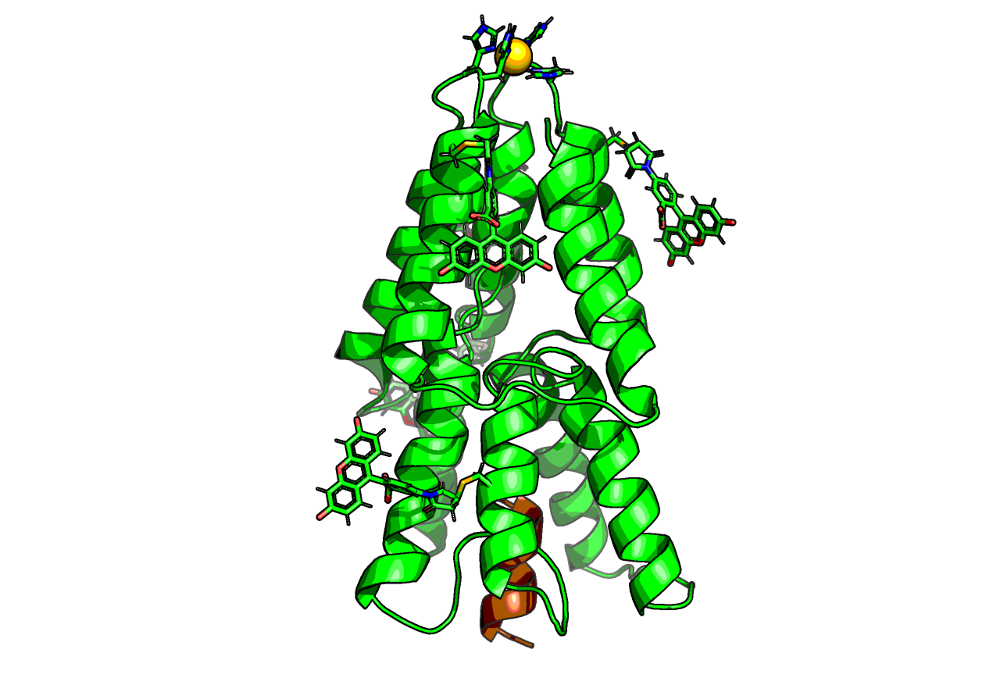
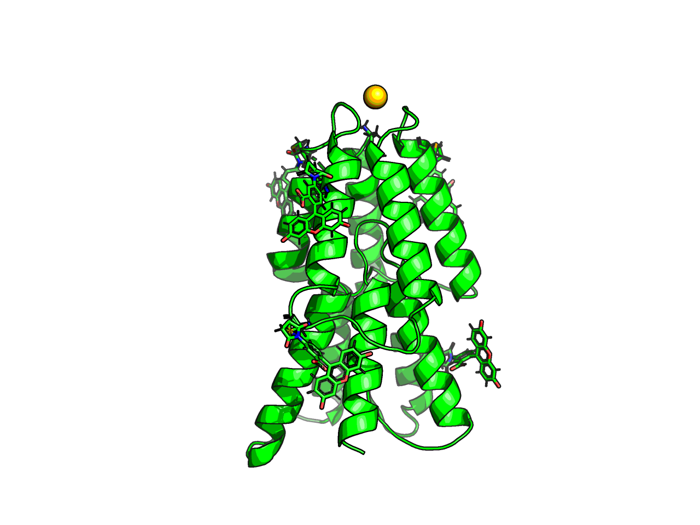
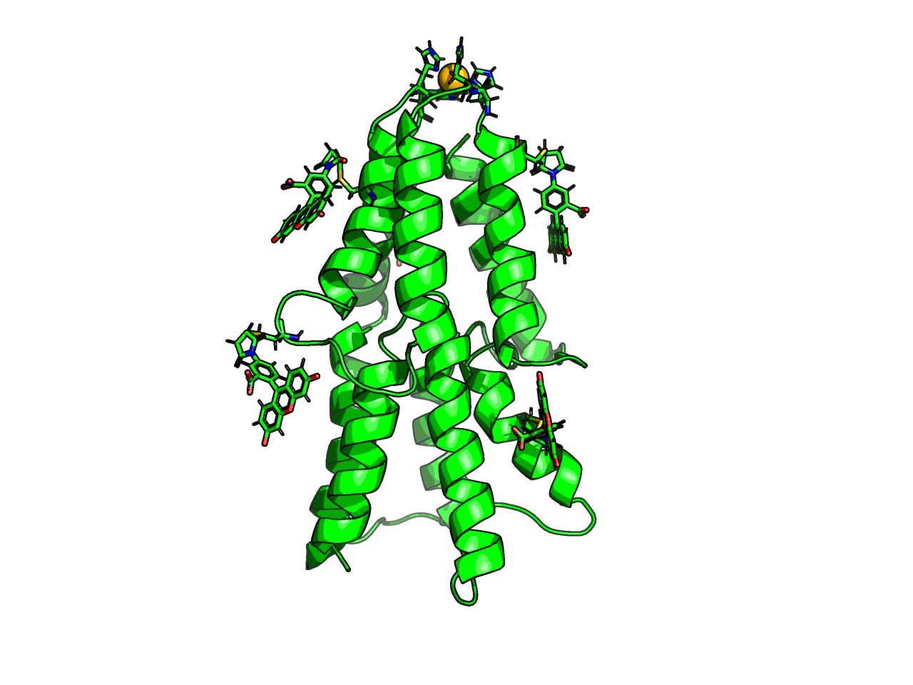

# Christmas_tree_protein

This is the data for the [Christmas tree protein I made](https://michelanglo.sgc.ox.ac.uk/data/83a2e29a-1e5e-41be-9fc9-9073c43dc482).

The tree was made with Rosetta and PyMol.

## Prototree

In a Jupyter notebook, I made the five helix edges, using a script I previous made ([protein_fuser](https://github.com/matteoferla/protein_fuser), which was a step that aligns the protein on the x-axis (the script fuses different structures of a multidomain protein togheter along the x-axis).

	from protein_fuser import Workshop, Model, pymol
	import math
	w = Workshop()
	pymol.cmd.delete('all')
	
	# make a helix
	pymol.cmd.fab('A'*16, 'leaf', chain='A', ss=1) # ss=1 is a helix
	pymol.cmd.alter('name C01','name="CA"')
	pymol.cmd.sort()
	# align to the x-axis.
	m = Model('custom', 'A', 'leaf', 1, 16, start=1, end=16, seq='A'*16, length=16, workshop=w)
	m.angle_fix()

	# the helix needs to be shifted downwards a bit though.
	ori = [0, 0, 0]
	pymol.cmd.translate([15, 0, 0], 'leaf', camera = 0)

	#copy 5 times but alternate the direction and rotate outwards by 20&deg;
	for i in range(5):
	    pymol.cmd.create(f'leaf{i}', 'leaf')
	    if i % 2 == 1:
		# N/C terminal flip
		pymol.cmd.rotate('z', 180, f'leaf{i}', origin=ori, camera=0)
		x, y, z = pymol.cmd.get_coords(f'/leaf{i}//A/16/C')[0]
		pymol.cmd.translate([-x + 15, -y, z], f'leaf{i}', camera=0)
	    pymol.cmd.rotate('z', 20 * math.sin(i * 2 * math.pi/5), f'leaf{i}', origin=ori)
	    pymol.cmd.rotate('y', 20 * math.cos(i * 2 * math.pi/5), f'leaf{i}', origin=ori)
	    pymol.cmd.alter(f'leaf{i}', f'resi=str(int(resi)+{i*16})')
	pymol.cmd.sort()
	pymol.cmd.delete('leaf')
	pymol.cmd.create('combo',' or '.join([f'leaf{i}' for i in range(5)]))
	pymol.cmd.save('test.pse')
	pymol.cmd.save('prototree.pdb', 'combo')

## Loop remodelling

The tree part (`prototree.pdb`) is great, but the parts need linking. So I made a blueprint file for relax for each of the three loops. See `prototree*.blu` files.

	remodel -s prototree.pdb -blueprint prototree3.blu -generic_aa G -find_neighbors -design_neighbors -suffix third -nstruct 5 -mute all &

As it's a loop, `generic_aa G` flag is there and as I am happy/would like nearby residues to be optimised too `-find_neighbors -design_neighbors` are added.

Then I picked the loops I liked them most, reguards of free-energy score combined them in PyMOL.

## Twin tree

In PyMOL I duplicated the tree and wedged the second one into the base of the first manually.
The loops were a bit silly on the base, so I remodelled them again.
I tried Rosetta fixbb (the ancient fixed-backbone mutator), but it was not happy with `ALLAA` as the default. Consequently I made a refile with the inner alanines changed, but the results were schmeh.

## Star

In RDKit, I played around by writing a few SMILES to make stars. Obviously, I was going to make it look connected by click-chemistry (so had a triazole ring `C1=C(C)N=NN1C...`)

But everything was a bit naff. So I opted for a gold atom instead.
For Rosetta, I made a params for gold by modding copper. Okay, the wdv is bigger, but who cares, this is for a Christmas tree.
So I mutated in four histidine and wrote up a constraint file as `-in:auto_setup_metals` may not like my gold (it does but oh well).

## Lights

Previously, I had done a project with [fluorescein isothiocyanite modelling](https://github.com/matteoferla/rosetta-pymol/tree/master/Fluorescein). So I had the files for the crosslinked residue &mdash;FITC forms a succinimide ring that gets hydrolysed and the fluorophore can be in lactone form (non-fluorescent) or acid form (fluorescent). I simple went with the succinimide ring acid form. I had a mol file with a sulfur on it for easy placement. In PyMOL I picked the best spots to decorate and mutated them.
I then attached them in the notebook.

	## Attach FLS lgiands
	targets = ['79', '89', '155','38', '67']
	pymol.cmd.delete('all')
	pymol.cmd.load('decorated2.pdb','prot')
	n = 210
	txt = ''
	for i, target in enumerate(targets):
	    pymol.cmd.load('FLS.pdb',f'ligand{i}')
	    pymol.cmd.pair_fit(f'ligand{i} & name S1',
		               f'resi {target} & name SG',
		               f'ligand{i} & name C1',
		               f'resi {target} & name HG')
	    pymol.cmd.remove(f'ligand{i} & name S1')
	    pymol.cmd.remove(f'resi {target} & name HG')
	    pymol.cmd.alter(f'ligand{i}',f"resi='{n+i}'")
	    pymol.cmd.alter(f'ligand{i}',f"chain='A'")
	    pymol.cmd.save(f'ligand{i}.pdb')
	    pymol.cmd.sort()
	    txt +=f'REMARK 666 MATCH TEMPLATE A CYS {target} MATCH MOTIF A FLS {n+i} 1 1\n'
	    txt +=f'LINK         SG  CYS A {target}                 C1  FLS A {n+i}                  1.83\n'
	    print(f'''AtomPair SG {target} C1 {n+i} HARMONIC 1.82 0.3
	Angle SG {target} C1 {n+i} C2 {n+i} HARMONIC 1.76 0.35
	Angle SG {target} C1 {n+i} C24 {n+i} HARMONIC 1.76 0.35
	Dihedral SG {target} C1 {n+i} C24 {n+i} O7 {n+i} HARMONIC 1.76 0.35''')
	pymol.cmd.save(f'liganded.pse')
	file = 'coupled.pdb'
	pymol.cmd.save(file, 'all')
	d = txt+open(file,'r').read()
	open(file,'w').write(d)

I was not sure if to dock (Rosetta ligand_dock needs the `REMARK` line) as I already had a constraint file for it or simple Relax (`LINK` line). I opted to simply use relax.
So I changed the EnzDes constraint file to the other format &mdash;I did not trip over the degree <=> non-&pi;-multipled radians for once! I still run a test on a cys+ligand just to be sure anyway. See `AuHis_FLS_shape.cons` file.

## Relax

This protein is an abomination. It is not optimised at all, so I hoped that I would get a mess with relax without constraints. But it was actually nearly okay...

Anyway, I constrained the bottom five vertices and the M1 residue CA (yes, I did change the first AA to methionine)

	## Write constraint file to keep base toghether
	from scipy.spatial import distance
	pymol.cmd.delete('all')
	pymol.cmd.load('stemmed.pdb','prot')
	resi = (1, 18, 70, 121, 128, 160, 172, 208, 10)
	coords = {i: list(pymol.cmd.get_coords(f'name CA and resi {i} and chain {"A" if i!=10 else "B"}')[0]) for i in resi}
	for i in resi:
	    for j in resi:
		if j >= i:
		    next
		else:
		    print(f'AtomPair CA {i} CA {j} HARMONIC {distance.euclidean(coords[i], coords[j])} 1')

The relax was done with `-extra_res_fa AU.params`, `-extra_res_fa FLS.params`, `-constraints:cst_file AuHis_FLS_shape.cons`, `-constraints:cst_weight 50` and `-in:auto_setup_metals`.

## Blink!

In Michelanglo, I uploaded the PDB and using the API I changed the `proteinJSON` to use a loading function (`loadfun`) and edited that to be:

	function loadfun (protein) {
	    var stage=NGL.getStage('viewport');

	    //define colors
	    let offscheme = NGL.ColormakerRegistry.addScheme(function (params) {
		this.atomColor = function (atom) {
		    chainid=atom.chainid;
		    let chainmap={'A': '0x33ff33', 'B': '0xd2b48c'};
		    let nonCmap = {'N': '0x3333ff', 'O': '0xff4c4c', 'S': '0xe5c53f', 'H': '0xe5e5e5', 'AU': '0xffd700'};
		    let resmap={'A210': '0x808080', 'A211': '0x808080', 'A212': '0x808080', 'A213': '0x808080', 'A214': '0x808080'};
		    if (! isNaN(parseFloat(chainid))) {chainid=atom.chainname} // hack for chainid/chainIndex/chainname issue if the structure is loaded from string.
		    if (atom.element in nonCmap) {return +nonCmap[atom.element]}
		    else if (chainid+atom.resno in resmap) {return +resmap[chainid+atom.resno]}
		    else if (chainid in chainmap) {return +chainmap[chainid]}
		    else {return 0x7b7d7d} //black as the darkest error!
		};
	    });
	    let onscheme = NGL.ColormakerRegistry.addScheme(function (params) {
		this.atomColor = function (atom) {
		let chainmap={'A': '0x33ff33', 'B': '0xd2b48c'};
		    let nonCmap = {'N': '0x3333ff', 'O': '0xff4c4c', 'S': '0xe5c53f', 'H': '0xe5e5e5', 'AU': '0xffd700'};    
		   let resmap={'A210': '0xdcdcdc', 'A211': '0xdcdcdc', 'A212': '0xdcdcdc', 'A213': '0xdcdcdc', 'A214': '0xdcdcdc'};
		    chainid=atom.chainid;
		     if (! isNaN(parseFloat(chainid))) {chainid=atom.chainname} // hack for chainid/chainIndex/chainname issue if the structure is loaded from string.
		    if (atom.element in nonCmap) {return +nonCmap[atom.element]}
		    else if (chainid+atom.resno in resmap) {return +resmap[chainid+atom.resno]}
		    else if (chainid in chainmap) {return +chainmap[chainid]}
		    else {return 0x7b7d7d} //black as the darkest error!
		};
	    });

	    //representations
		protein.removeAllRepresentations();
		let cartoon = new NGL.Selection( "*" );
		protein.addRepresentation( "cartoon", {color: offscheme,  sele: cartoon.string, smoothSheet: true, opacity: 1.0} );

		let sticks = new NGL.Selection( "sidechainAttached" );
		let sticks2 = new NGL.Selection( "FLS" );
		
		protein.addRepresentation( "spacefill", {color: onscheme,  sele: 'AU', opacity: 1.0} );
		protein.addRepresentation( "hyperball", {color: onscheme,  sele: sticks.string, opacity: 1.0} );
		protein.addRepresentation( "hyperball", {color: offscheme,  sele: sticks2.string, opacity: 1.0} );
		protein.addRepresentation( "hyperball", {color: onscheme,  sele: sticks2.string, opacity: 1.0} );
		protein.reprList[4].toggleVisibility();
	    setInterval(() => {
	    let protein = NGL.getStage().compList[0];
	    protein.reprList[4].toggleVisibility();
	    protein.reprList[3].toggleVisibility();
	    }, 1000);
		
		        
	    //orient
	    stage.viewerControls.orient((new NGL.Matrix4).fromArray([11.3,-176.3,-29.7,0,178.2,13.4,-12.2,0,14.2,-28.8,176.2,0,-37.5,3,3.1,1]));
	    stage.setParameters({ cameraFov: 20.0, fogNear: 45.0}); //clipFar: 32.01997375488281, clipNear: -32.016510009765625
	    NGL.getStage().animationControls.spin()
	}

Note that NGL seems to ignore `LINK` lines so the FITC-cys seem unliked. But actually aren't.
